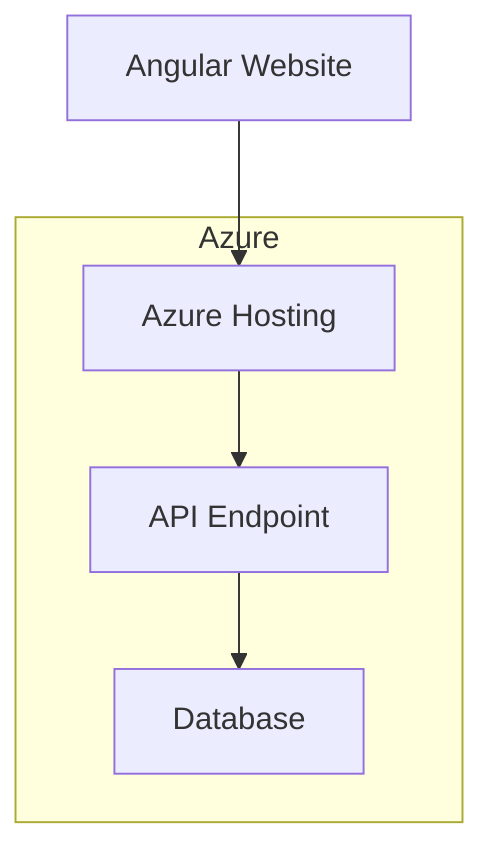

# Wedding website for Valentine and Philippe

This repo contains all the components for the wedding website of Valentine and Philippe. The architecture is pretty straightforward.

## Schema

## Frontend
The frontend is written in Angular 18 and communicated to a .NET 8 WebApi.

## Backend
The backend is a .NET 8 api that uses the following packages:

- MediatR
- FluentValidation
- OneOf

This was chosen as it makes it flexible to further extend the api if needed in the future.

